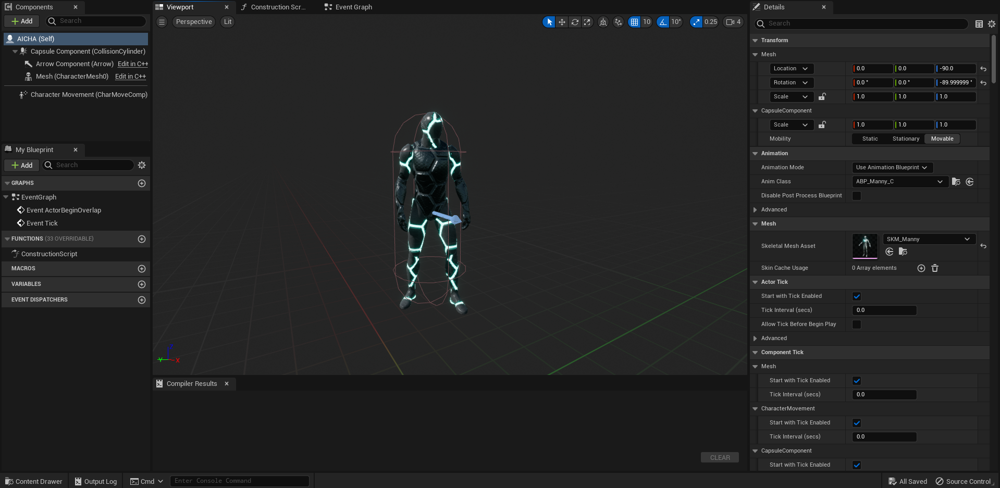

# EXP-06-AI-random-movement

## AIM:
To implement AI concept to actor for a random movement .

## ALGORITHM:
### Step:01
Create a Character Blueprint:

    In the Content Browser, right-click in the desired folder.
    Select Create Basic Asset > Blueprint Class.
    Choose the appropriate parent class for your AI character (e.g., Character or Pawn).
    Name the Blueprint (e.g., "AICharacter") and click Create.
### Step:02
Create a Blackboard:

    In the Content Browser, right-click in the desired folder.
    Select Create Basic Asset > AI > Blackboard.
    Name the Blackboard (e.g., "AIBlackboard") and click Create.
### Step:03
Open the Behavior Tree editor:

    In the Content Browser, find the Blackboard asset you just created.
    Right-click the Blackboard asset and select Create > Behavior Tree.
    Name the Behavior Tree (e.g., "AIBehaviorTree") and click Create.
    Double-click the Behavior Tree asset to open it in the Behavior Tree editor.
### Step:04
Create Behavior Tree nodes:

    In the Behavior Tree editor, right-click in the graph and search for and add the following nodes:
    "Selector" node: Controls the execution of child nodes.
    "Service" node: Monitors and updates values in the Blackboard.
    "Sequence" node: Executes child nodes in sequential order.
    "Random" decorator: Randomly selects a child node to execute.
    "Move To" task: Moves the AI character to a specified location.
    Connect the nodes to create the desired behavior flow. For example:
    Connect the Selector node to the Service and Sequence nodes.
    Connect the Random decorator to the Sequence node.
    Connect the Move To task to one of the child nodes of the Random decorator.
### Step:05
Set up the Blackboard:

    Open the AIBlackboard asset.
    In the Blackboard editor, define the necessary keys for storing data, such as:
    Vector keys: for storing target locations.
    Bool keys: for storing condition flags.
    Save the AIBlackboard asset.
### Step:06
Set up the AI character Blueprint:

    Open the AICharacter Blueprint.
    In the Blueprint editor, find the Components panel.
    Add an AI Controller component to the AICharacter Blueprint.
    In the Details panel, under the AI Controller section, set the AIController Class to the desired AI controller class (e.g., AIController).
    Save the AICharacter Blueprint.
### Step:07
Set the AI controller and behavior tree:

    Open the AIController Blueprint.
    In the Blueprint editor, locate the Event Begin Play event.
    Drag off the execution line and search for "Possess".
    In the Possess node, select the AICharacter Blueprint you created.
    Drag off the AICharacter reference and search for "Use Blackboard".
    Connect the output of the Use Blackboard node to the AIController's Blackboard property.
    In the Blackboard property, select the AIBlackboard asset you created.
    Drag off the AICharacter reference again and search for "Run Behavior Tree".
    Connect the output of the Run Behavior Tree node to the AIController's Behavior Tree property.
    In the Behavior Tree property, select the AIBehaviorTree asset you created.
    Save the AIController Blueprint.
### Step:08
Set up the NavMesh and boundaries:

    Place a NavMeshBoundsVolume in your level to define the boundaries for the AI character's movement.
    Adjust the size and position of the NavMeshBoundsVolume to cover the desired playable area.

## OUTPUT:

### AI PLAYER MESH

### AI BLACKBOARD FOR KEY CREATION

### BEHAVIOR TREE

### BLACKBOARD EVENT GRAPH

### GAME NAVMESHBOUNDVOLUME

### IN PLAY MODE

## RESULT:
Thus, AI concept to actor for a random movement is implement.
